# AWIPA Appplication


## Use Case


## Kegunaan
Aplikasi ditujukan untuk penyimpanan file pada sebuah organisasi dengan tujuan untuk mengatasi masalah penyimpanan berkas pada ruangan yang tidak memadai, sehingga dapat menghemat tempat. aplikasi ini dilengkai pula dengan beberapa fitur keamanan yang dapat digunakan untuk menjaga kerahasaiaan data.

## Fitur Keamanan
1. Menggunakan hash pada database data
2. Menggunakan two factor authentication
3. Menggunakan enkripsi dan dekripsi file
4. Data akun user tidak disatukan, namun terpisah

## Requirements
- download xampp atau lampp
- jaringan internet

## Installasi
1. download awipa.sh pada github
```c
$ git clone https://github.com/tambunanprd/ArsipSystem.git
```
2. masuk ke terminal linux, untuk melakukan instalasi input:
```c
$ chmod +x awipa.sh
$ ./awipa.sh
```
3. klik next seperti pada gambar
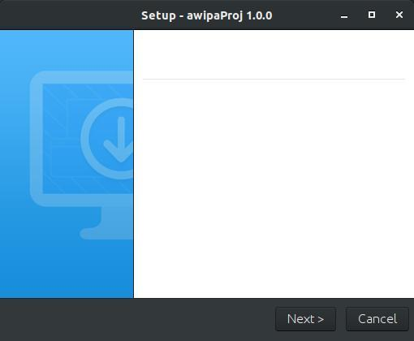

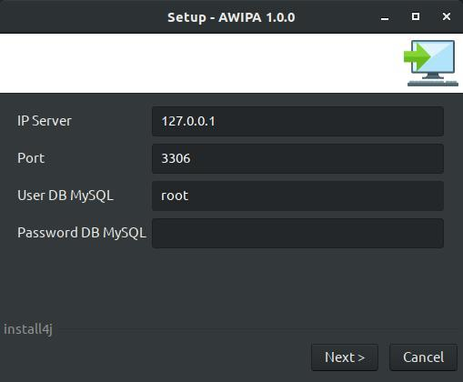
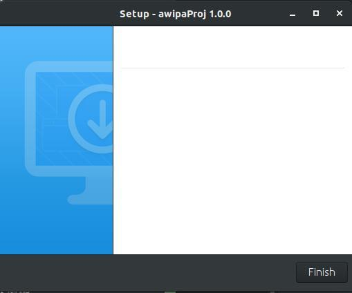
4. aplikasi sudah di install pada komputer anda\


### Registrasi
jika anda belum memiliki akun maka lakukan registrasi dengan melakukan klik pada tulisan di bawah tombol login\
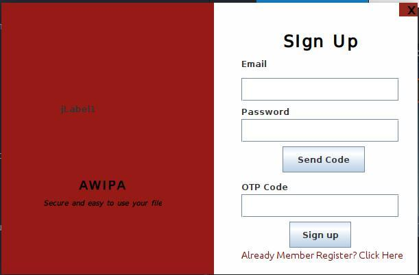
1. masukkan email dan password yang ingin anda daftarkan, lalu klik send code\
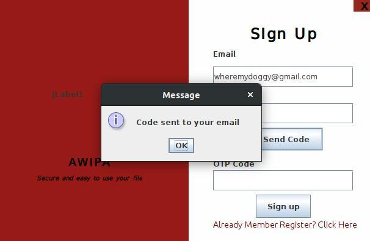
2. buka email yang kamu daftarkan untuk mendapatkan kode otp\

3. masukkan kode otp yang telah dikirimkan\
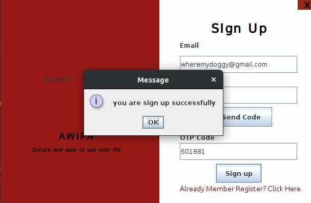

### Login
1. masukkan email dan password\
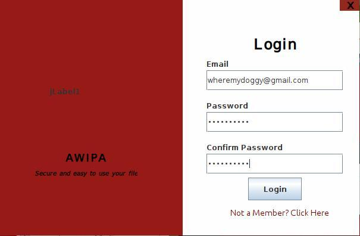
2. jika berhasil login, akan masuk pada halaman awal aplikasi\


### Fitur aplikasi
##### Enkripsi
pada fitur ini *user* dapat melakukan enkripsi file yang ada pada komputer tanpa harus menyimpannya pada aplikasi serta dapat pula melakukan enkripsi pada file yang telah disimpan pada aplikasi\
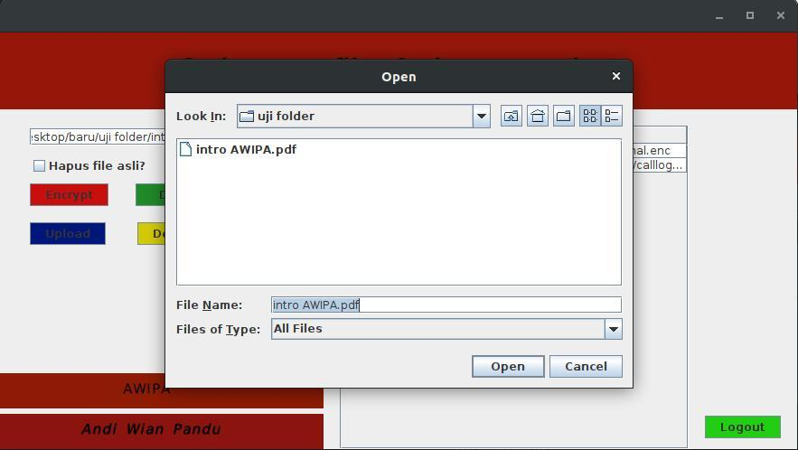\
klik tombol merah untuk melakukan enkripsi, lalu masukkan kunci untuk melakukan enkripsi\

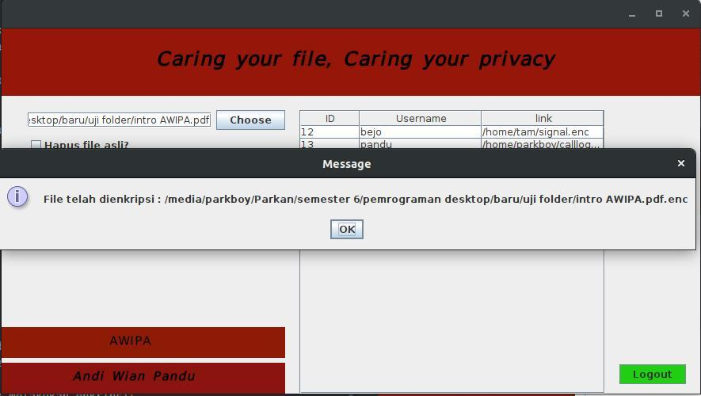\


#### Dekripsi
pada fitur ini *user* dapat melakukan dekripsi file yang telah di enkripsi sebelumnya dengan menggunakan kunci yang sama\


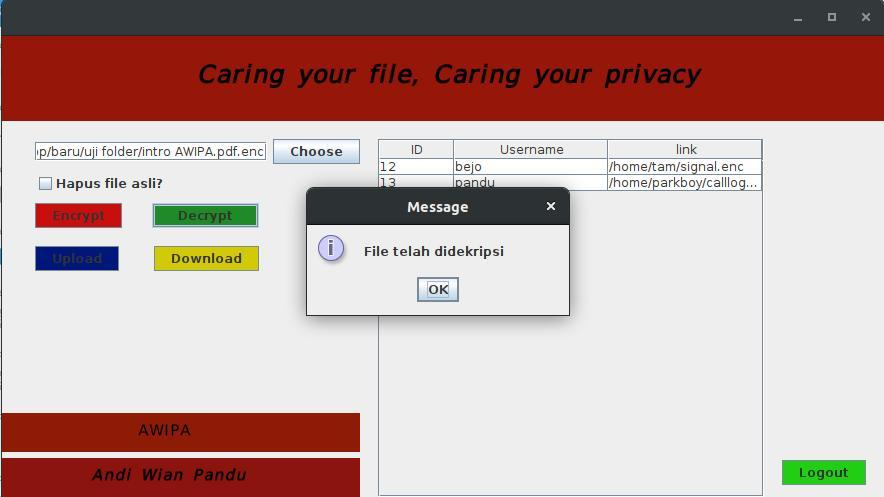

#### Upload
pada fitur ini *user* dapat melakukan penyimpanan file pada aplikasi\
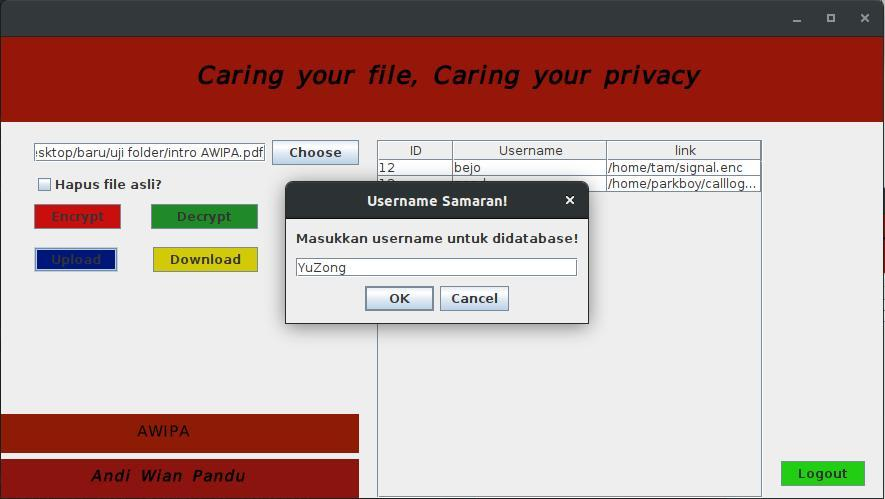
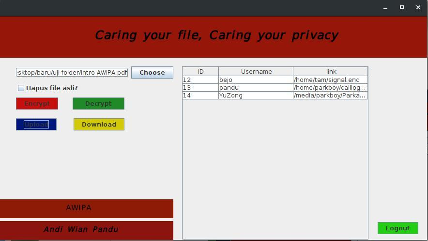

#### Download
pada fitur ini *user* dapat mendownload kembali file yang pernah di upload pada aplikasi\

### Uninstall
dapat dilakukan uninstall aplikasi dengan cara masuk ke folder hasil instalasi\
#### Linux
```c
$ ./uninstall
```


#### Windows
klik dua kali pada file uninstall.
